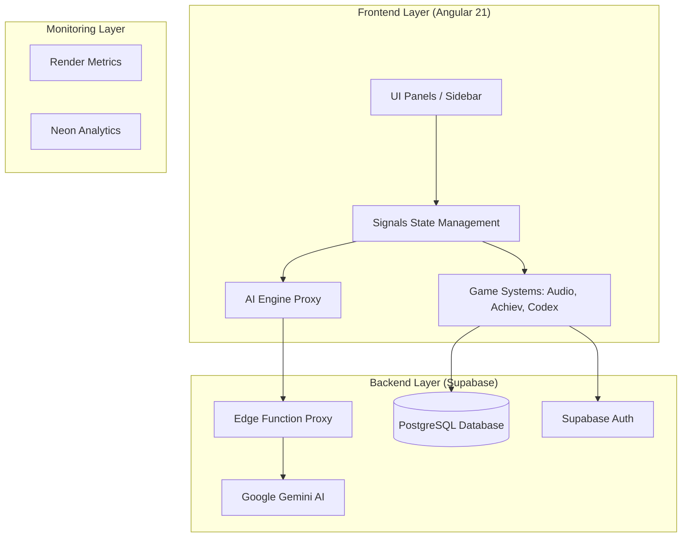

# Infinite Adventure Engine

Welcome to the Infinite Adventure Engine (IAE), a cutting-edge web application that redefines the choose-your-own-adventure genre. Powered by Google Gemini API and modern cloud infrastructure, this application offers a truly dynamic, secure, and endless storytelling experience.

**Live Production Demo**: [https://infinite-adventure-engine.onrender.com/](https://infinite-adventure-engine.onrender.com/)

---

## 🏛 Engine Architecture

The IAE is designed as a modular, industry-standard game engine tailored for the web.



### Core Engine Pillars
-   **Core Gameplay Loop**: Automated turn management and adaptive difficulty scaling.
-   **Rendering Layer**: Zoneless Angular UI visualizing real-time AI-generated imagery.
-   **State Management**: Signals-based architecture for reactive inventory, quests, and lore.
-   **Asset Pipeline**: Secure on-the-fly generation and fetching of AI assets.
-   **Persistence**: Distributed cloud saves via Supabase.

---

## 🚀 Getting Started

### Local Setup
1.  **Clone the Repository**:
    ```bash
    git clone https://github.com/joyiswar/Infinite-Adventure-Engine.git
    cd Infinite-Adventure-Engine
    ```

2.  **Install Dependencies**:
    ```bash
    npm install --legacy-peer-deps
    ```

3.  **Configure Environment**:
    Create a `.env` file with your credentials:
    ```env
    VITE_SUPABASE_URL=your_supabase_url
    VITE_SUPABASE_ANON_KEY=your_supabase_key
    ```

### Running the Application
-   **Development Mode**: `npm run dev`
-   **Production Build**: `npm run build`
-   **Local Preview**: `npm run serve`

---

## 🛠 Production Deployment

### Frontend (Render)
-   **Platform**: [Render](https://render.com)
-   **Build Command**: `npm install --legacy-peer-deps && npm run build`
-   **Start Command**: `npm run serve`
-   **Environment Variables**: `VITE_SUPABASE_URL`, `VITE_SUPABASE_ANON_KEY`.

### Backend (Supabase)
-   **Database**: PostgreSQL for save slots and achievements.
-   **AI Proxy**: Edge function deployed at `/functions/v1/adventure-engine`.
-   **Security**: `GEMINI_API_KEY` stored securely in Supabase Secrets.

---

## 📈 Roadmap (Linear Board)
Work is organized into a prioritized roadmap:
-   **Sprint 1**: Stabilization & Test Coverage (INF-12, INF-13).
-   **Sprint 2**: Features & Realtime Social (INF-14, INF-15).
-   **Sprint 3**: Scaling & Analytics (INF-16).

---

## 👨‍💻 About the Developer

**Mamun Chowdhury**
Senior IT Project Manager & Software Architect

Mamun is a technical leader dedicated to building high-performance, AI-integrated web applications and scalable backend infrastructures.

-   **Portfolio & Contact**: [https://mamun.pt](https://mamun.pt/)
-   **LinkedIn**: [Mamun Chowdhury](https://www.linkedin.com/in/mamun-pt/)
-   **Company**: [Vertigo Sourcing](https://vertigosourcing.com)
